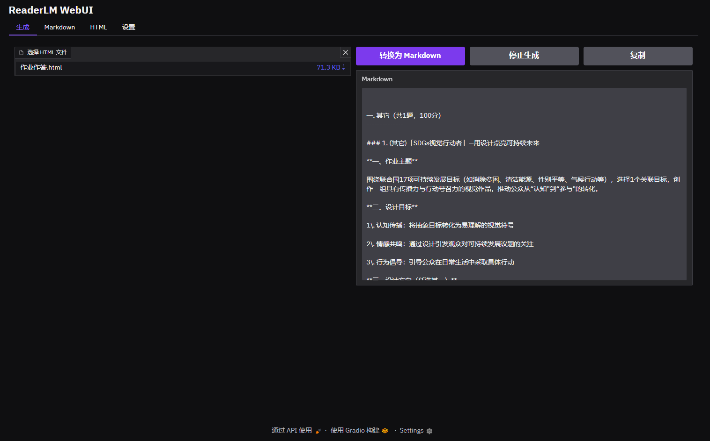

# ReaderLM-WebUI

适用于 ReaderLM 的 Gradio WebUI



## 开发计划

- [ ] 英文本地化 / Localize (English)
- [ ] V2 模型的完整支持（当前版本仍然能够使用V2模型，只是效果可能没那么好）
- [ ] 在转换前清理 HTML

## 部署

### 依赖

你需要以下库：

```text
llama-cpp-python
pyperclip
gradio
```

### 开始使用

```commandline
python .\GUI.py
```

